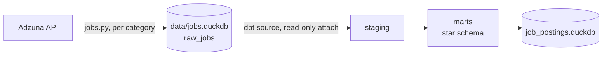

# Job Postings Analytics Pipeline

Pull job postings from the [Adzuna API](https://developer.adzuna.com/), land them in DuckDB, and model them into a Kimball-style star schema with dbt. The motivating question is how salary disclosure varies across job categories.

## Architecture



`jobs.py` pulls jobs one category at a time (31 tags), capping each category at `MAX_PAGES = 4` pages (200 jobs), and writes everything into `raw_jobs`. dbt then treats that database as a **read-only** attached source (`job_postings/profiles.yml`) and builds a separate warehouse file, `job_postings/job_postings.duckdb`. Ingestion and transformation never share write access to the same file.

## Data model

One fact, four dimensions, one aggregate, staging → marts (type casting, null-standardization, and key generation happen once in staging so the mart layer is just joins and business logic):

| Model | Grain / key strategy |
|---|---|
| `fct_job_postings` | One row per job posting. FKs to all four dimensions; salary measures (min/max/mid, range width); `is_salary_disclosed` flag; contract attributes. |
| `dim_category` | Adzuna's category tag, natural key. Also carries `adzuna_total_count`, Adzuna's own reported count for that category, alongside whatever was actually retrieved, so an under-sampled category (capped by `MAX_PAGES`) can be identified later. |
| `dim_company` | Natural key (`lower(company_name)`); see entity-resolution caveat below. |
| `dim_location` | Hashed surrogate key (`dbt_utils.generate_surrogate_key`) over country/region/city/district. Location is inherently a composite of up to four columns, not a single natural identifier, so the hash collapses however many of them are available into one join column instead of joining on several. |
| `dim_date` | Generated date spine (`dbt_utils.date_spine`), not derived from the fact table, so a date with zero postings still has a row. |
| `agg_disclosure_by_category` | Aggregate mart, one row per `dim_category` where `tag_type = 'Occupation'`. `postings`, `disclosed`, and `disclosure_rate` from `fct_job_postings`, joined on `category_key`. Filtered to `'Occupation'` so non-occupation tags (career stage, contract type, employer type, residual) don't get compared against true job categories. |

## Engineering decisions

- **Idempotent ingestion.** `job_id` is the primary key on `raw_jobs`, with `ON CONFLICT DO NOTHING` on insert. `jobs.py` can be re-run without duplicating rows.
- **Type casting happens once, in staging.** `salary_is_predicted` and `created` are strings in the raw source; `stg_adzuna__jobs` casts them once (to `boolean` and `timestamptz`) rather than repeating that logic anywhere downstream.
- **Key strategy chosen per dimension, not uniformly.** Natural keys where a column is already clean and unique; a hashed surrogate key only where the dimension is genuinely composite (location).
- **Scoped to the UK only.** Adzuna's UK postings have more complete salary data than its other markets, and the category list (`GB_CATEGORY_TAGS`) is UK-specific taxonomy; adding a country later means building that country's own category list, not just adding a code to `COUNTRY_CODES`.
- **Credentials via environment variables only.** `ADZUNA_APP_ID` / `ADZUNA_APP_KEY` are read from the environment; the script fails fast with a clear error if either is missing.
- **DB path configured once, via `JOBS_DB_PATH`.** Both `jobs.py` and `job_postings/profiles.yml` read the same `JOBS_DB_PATH` env var for the raw database's location, so ingestion and dbt can never point at different files by accident.
- **Per-category error isolation.** One category's API failure (HTTP error, network error, bad JSON) is caught and logged without aborting the run for the rest.

# Data quality

- **63% of postings disclose a salary; 37% (2,141 of 5,796) are Adzuna-predicted.** `is_salary_disclosed` in `fct_job_postings` is just the inverse of the raw `is_salary_predicted` flag.
- **Four rows went missing across paginated category pulls** (198 ins   tead of 200, for 2 of 29 categories). Most likely cause: offset-pagination drift (a posting shifted across a page boundary between requests, got refetched, and was silently deduplicated by the `job_id` primary key). Confirmed immaterial to category-level counts.
- **Company names aren't entity-resolved:** "Acme Ltd" and "Acme Limited" count as two employers. 
- **Adzuna's category taxonomy isn't mutually exclusive by construction** (an IT role at a hospital could plausibly be "IT" or "Healthcare"); boundary cases land in one category arbitrarily, which caps how much weight any single category-level finding can bear.

## Tech stack

Python · dbt · DuckDB · sqlfluff · uv


## Setup and running

**1. Install dependencies**
```
uv sync
```
Requires Python >=3.14 (pinned in `.python-version`).

**2. Set environment variables**
```
cp .env.example .env
```
Fill in `ADZUNA_APP_ID` / `ADZUNA_APP_KEY` (free keys at [developer.adzuna.com](https://developer.adzuna.com/)) and `JOBS_DB_PATH`, an absolute path to where the raw database should live (e.g. `/abs/path/to/data/jobs.duckdb`). Both `jobs.py` and dbt's `profiles.yml` read from it. `job_postings/.envrc` (`dotenv`) auto-loads the root `.env` for dbt if you use [direnv](https://direnv.net/); otherwise `export` the variables yourself before running the commands below.

**3. Run ingestion**
```
uv run python jobs.py
```
Writes to `$JOBS_DB_PATH`. Safe to re-run. Edit `MAX_PAGES`, or `SEARCH_PARAMS` in the script to change scope.

**4. Build the warehouse**
```
cd job_postings
uv run dbt deps
uv run dbt build
```
`profiles.yml` attaches the raw database read-only via `{{ env_var('JOBS_DB_PATH') }}` 
