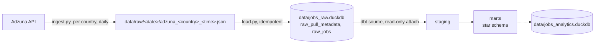

# Job Postings Analytics Pipeline

Pull job postings from the [Adzuna API](https://developer.adzuna.com/) daily for the UK, Italy, the Netherlands, Spain and Poland, land the raw JSON in DuckDB, and model it into a Kimball-style star schema with dbt. The motivating question is how the rate at which job ads state a salary changes over time, per country, as EU member states transpose the [Pay Transparency Directive (EU) 2023/970](https://eur-lex.europa.eu/eli/dir/2023/970/oj) (transposition deadline 7 June 2026), with non-EU markets such as the UK as controls.

## Architecture



Ingestion is split in two so the API response is kept verbatim and can always be reloaded:

- **`ingest.py`** loops over `COUNTRY_CODES`, requests the most recent postings for each (`max_days_old=1`, `sort_by=date`, up to `MAX_PAGES = 14` pages of 50, i.e. 700 postings per country per day), and writes one JSON envelope per country per run to `$JOBS_RAW_DATA_DIR/<YYYY-MM-DD>/adzuna_<country>_<HHMMSS>.json`. The envelope records the search parameters, Adzuna's total match count and mean salary for the query, and how many pages actually returned results, alongside the raw job objects.
- **`load.py`** walks every JSON file under `$JOBS_RAW_DATA_DIR` and loads it into two tables: `raw_pull_metadata` (one row per file/pull) and `raw_jobs` (one row per job per pull). A pull's `pull_id` is derived from its path, so re-running skips files already loaded, and each file is loaded in a single transaction.

dbt then treats the raw database as a **read-only** attached source (`job_postings/profiles.yml`) and builds a separate warehouse file at `$JOBS_ANALYTICS_DB_PATH`. Ingestion and transformation never share write access to the same file.

## Data model

One fact, five dimensions, two aggregates, staging → marts. Type casting, null-standardisation and key generation happen once in staging (`stg_adzuna__jobs`), so the mart layer is just joins and business logic.

| Model | Grain / key strategy |
|---|---|
| `fct_job_postings` | One row per job posting. The same job is returned by consecutive daily pulls, so the fact keeps only the **first observation** of each `job_id` (`times_seen` records how many pulls returned it). FKs to all five dimensions; salary measures (min/max/mid, range width); `salary_status` and `is_salary_disclosed`; contract attributes. |
| `dim_country` | One row per Adzuna country endpoint, built from the `country_codes` seed: currency, EU membership, `pay_transparency_effective_date`, whether pay must appear in the ad itself, and free-text legislation notes. The seed is the place to edit as legislation lands. |
| `dim_category` | Adzuna's category tag, natural key. Tags are shared across Adzuna markets but labels are localised, so the UK (English) label is preferred. The `tag_type` mapping has no default: an unclassified tag from a new market fails the `not_null` test rather than silently landing in a bucket. |
| `dim_company` | Natural key (`lower(company_name)`); see entity-resolution caveat below. |
| `dim_location` | Hashed surrogate key (`dbt_utils.generate_surrogate_key`) over Adzuna's up-to-four-level location breakdown. Location is inherently a composite, so the hash collapses however many levels are available into one join column. |
| `dim_date` | Generated date spine (`dbt_utils.date_spine`) from a week before the first pull to a week after the run date, so a date with zero postings still has a row and the horizon never needs manual extending. `full_date` is the DATE; `date_key` is the integer `YYYYMMDD` surrogate the fact stores. |
| `agg_disclosure_daily` | One row per country per **posting date**: `postings`, `disclosed`, `predicted`, `absent` and the corresponding rates, plus `days_since_pay_transparency_effective` and `is_post_pay_transparency` from `dim_country`. This is the table for plotting disclosure rate over time and for before/after comparisons in event time. |
| `agg_disclosure_by_category` | One row per `dim_category` where `tag_type = 'Occupation'`, with postings and disclosure rate. Blended across countries; useful as a category-mix covariate for the time series (see below). |

### Salary status

`salary_status` on the fact distinguishes three cases that a single boolean conflates:

| `salary_status` | Meaning |
|---|---|
| `disclosed` | The ad stated a salary (`salary_is_predicted = 0` and a salary value is present). |
| `predicted` | The ad had no salary; Adzuna estimated one (`salary_is_predicted = 1`). |
| `absent` | No salary at all. Rare in the UK, where Adzuna predicts whenever the ad is silent, but common in other markets. |

`is_salary_disclosed` is `salary_status = 'disclosed'`, so postings with no salary count as *not* disclosed. This matters for cross-country comparisons: treating "not predicted" as "disclosed" would inflate the rate wherever Adzuna doesn't predict.

## Engineering decisions

- **Raw JSON is the system of record.** `ingest.py` writes the API response verbatim; `load.py` can rebuild the raw database from the files at any time, and new fields can be picked up later without re-pulling.
- **Idempotent load.** `pull_id` is derived deterministically from the file path and is the primary key of `raw_pull_metadata`; `raw_jobs` is keyed on `(pull_id, job_id)`. `load.py` skips pulls already present and loads each file in one transaction, so a failed or interrupted run can simply be re-run.
- **Grain is enforced where it changes.** Staging keeps the raw `(pull_id, job_id)` grain; the fact reduces to `job_id` with a `row_number()` over `fetched_at` (a CTE rather than `QUALIFY`, so the pattern ports to Postgres). Both grains have uniqueness tests.
- **First observation wins.** A posting's salary as first seen is the relevant one for the disclosure question; later pulls of the same job don't overwrite it.
- **Type casting happens once, in staging.** `salary_is_predicted` and `created` are strings in the raw source; `stg_adzuna__jobs` casts them once (to `boolean` and a naive UTC `timestamp`).
- **All timestamps are naive UTC.** `ingest.py` records `fetched_at` in UTC, `load.py` stores it as a naive `TIMESTAMP`, and staging passes it through untouched, so the warehouse is identical regardless of the machine or session timezone that builds it. Adzuna's `created` carries a `Z` but is actually wall-clock time in the market's own timezone (see Data quality), so the seed records each market's IANA timezone and staging converts `created` to `posted_at_utc` with it; the raw wall-clock value is kept alongside as `posted_at_local`. One consequence: a UTC "day" starts at 01:00 in London and 02:00 in Warsaw, which is immaterial at daily granularity and irrelevant at weekly.
- **Country reference data lives in one seed.** `seeds/country_codes.csv` holds the code → name → currency mapping and the legislation columns. Staging joins it for currency (a country missing from the seed fails the `not_null` test rather than getting a placeholder), `dim_country` is built from it, and a singular test (`assert_country_mapping_valid`) checks that the country name Adzuna returns matches the seed. Adding a country means adding one CSV row (and the code to `COUNTRY_CODES` in `ingest.py`).
- **Key strategy chosen per dimension, not uniformly.** Natural keys where a column is already clean and unique; a hashed surrogate key only where the dimension is genuinely composite (location).
- **Credentials and paths via environment variables only.** `ADZUNA_APP_ID` / `ADZUNA_APP_KEY`, `JOBS_RAW_DATA_DIR`, `JOBS_RAW_DB_PATH` and `JOBS_ANALYTICS_DB_PATH` are read from the environment; both scripts fail fast with a clear error if one is missing. `profiles.yml` reads the same variables, so ingestion and dbt can never point at different files by accident.
- **Per-country error isolation, except for rate limits.** One country's API failure (HTTP, network, bad JSON) is logged and the run continues; the process exits non-zero at the end if anything failed. An HTTP 429 aborts the run immediately without retrying, because retries count against the daily cap and every further call would fail too. Calls are spaced `REQUEST_DELAY_SECONDS = 2.5` apart to stay under the per-minute limit, so a full run takes about three minutes.
- **A missed day is lost.** `max_days_old=1` means a day that isn't pulled can't be recovered later, so the daily job needs to actually run daily (five countries at 14 pages is 70 calls, within the free tier's daily budget); scheduled CI runs (e.g. GitHub Actions cron) can be delayed or skipped, so check `raw_pull_metadata` for gaps.

## Analysis: disclosure over time

The daily pull is designed for an event-study style comparison: each country's disclosure rate over time, aligned on the date its pay-transparency rules took effect (`days_since_pay_transparency_effective` in `agg_disclosure_daily`), with the UK as a never-treated control. Things to keep in mind when reading the series:

- **Only within-country change is meaningful; levels across countries are not comparable.** Adzuna's salary extraction varies by market: Austria, where salary in the ad has been legally required since 2011, showed 0 of 100 postings with a salary, and Germany 0 of 700. So a low `disclosure_rate` in one market versus another reflects Adzuna's parsing as much as employer behaviour. The question the data can answer is whether a country's *own* rate moves when its rules change, relative to the UK's over the same period.

- **The directive doesn't require pay in the ad.** Article 5 requires employers to give applicants the pay or pay range *before the interview*, which can be in the ad or elsewhere. Some national transpositions go further and require it in the ad itself; `dim_country.requires_pay_in_job_ad` records which. The interesting contrast is between those two groups, not just EU vs non-EU.
- **Category mix is a confound.** Disclosure varies strongly by occupation category, so a shift in the category mix of the daily sample moves the raw rate without any change in behaviour. `agg_disclosure_by_category` and `category_key` on the fact are there to standardise the daily rate to a fixed category mix.
- **Sample size and timing.** Each pull is the most recent `MAX_PAGES × 50` postings at fetch time, so for high-volume markets it's a slice of the day, and whichever job-board feed imported last dominates it (a first 100-posting pull for Germany was two employers' bulk feeds). At the base rates seen outside the UK (5–15%), a day of 100 postings has a ±3pp standard error, the same size as any plausible legislative effect; 600 per day and weekly aggregation are the minimum for the comparison to mean anything. `raw_pull_metadata.pages_with_results = max_pages` flags truncated pulls; `total_count` gives Adzuna's own daily volume for the query.
- **Adzuna only predicts salaries in the UK.** In the first pull every non-UK posting was either `disclosed` or `absent`; `predicted` was UK-only. That is why `salary_status` is three-valued.
- **Adzuna's prediction model is itself a moving part.** If Adzuna changes when it predicts a salary, `salary_status` shifts everywhere at once. The non-EU controls are the check for that.
- **The most recent date is always partial.** A daily pull with `max_days_old=1` sees only part of today's postings; the rest arrive in tomorrow's pull.

## Data quality

- **Company names aren't entity-resolved:** "Acme Ltd" and "Acme Limited" count as two employers.
- **Adzuna's category taxonomy isn't mutually exclusive by construction** (an IT role at a hospital could plausibly be "IT" or "Healthcare"); boundary cases land in one category arbitrarily, which caps how much weight any single category-level finding can bear.
- **Location depth varies by country.** `location.area` has up to four levels, and what level 2–4 mean differs between markets; `dim_location.granularity_level` records how many were present.
- **Markets checked and left out.** On 2026-09-21, 2-page test pulls found no salary data at all for `de` (0 of 700), `at` (0 of 100) and `fr` (0 of 100, and 100% category `unknown`); `be` had 12 of 100 but the values were unannualised daily/monthly rates from a single agency. The raw files are kept under `data/excluded/`. Germany's two pulls from that day remain in the raw database and the seed, so its rows appear in the marts with a 0% rate.
- **Salary units outside the UK are not verified.** Adzuna annualises UK salaries; the Belgian sample showed daily and monthly figures passed through as-is. Salary *levels* in `fct_job_postings` for non-UK markets should be sanity-checked before use; the disclosure flag is unaffected.
- **`created` is local time with a misleading `Z`.** In every market the latest `created` in a pull is 1–2 hours *after* the UTC fetch time, consistent with wall-clock time in the market's timezone (BST for gb, CEST for the rest). Staging converts it to UTC using the market's timezone from the seed (`posted_at_utc`) and keeps the wall-clock value as `posted_at_local`.
- **`dim_country` legislation columns are hand-maintained** (`legislation_checked_on` says when). Several rows are expected to change during the observation window; a dbt snapshot over the seed would turn that into a type-2 history so each posting joins to the rule in force on its posting date.
- **`country_name` comes from Adzuna, not from the pull loop.** It is `location.area[0]` on each job. It is expected to always be present and is tested `not_null`; `assert_country_mapping_valid` fails if Adzuna spells a country differently from the seed.

## Tech stack

Python · dbt · DuckDB · sqlfluff · uv

## Setup and running

**1. Install dependencies**
```
uv sync
```
Requires Python >=3.14 (pinned in `.python-version`).

**2. Set environment variables**
```
cp .env.example .env
```
Fill in `ADZUNA_APP_ID` / `ADZUNA_APP_KEY` (free keys at [developer.adzuna.com](https://developer.adzuna.com/)), and absolute paths for `JOBS_RAW_DATA_DIR` (where the JSON files go), `JOBS_RAW_DB_PATH` (the raw DuckDB file) and `JOBS_ANALYTICS_DB_PATH` (dbt's warehouse file). `ingest.py` reads the data dir; `load.py` reads the data dir and the raw DB path; dbt's `profiles.yml` reads both DB paths. If you use [direnv](https://direnv.net/), a `job_postings/.envrc` containing `dotenv ../.env` will auto-load them for dbt; otherwise `export` the variables yourself before running the commands below.

**3. Pull and load**
```
uv run python ingest.py
uv run python load.py
```
`ingest.py` writes one JSON file per country to `$JOBS_RAW_DATA_DIR/<date>/`; `load.py` loads any files not yet in `$JOBS_RAW_DB_PATH`. Both are safe to re-run. Edit `COUNTRY_CODES`, `MAX_PAGES` or `SEARCH_PARAMS` in `ingest.py` to change scope, keeping `len(COUNTRY_CODES) * MAX_PAGES` within the API's daily call budget; when adding a country, also add its row to `job_postings/seeds/country_codes.csv`. Run both daily (cron or similar) to build the time series.

**4. Build the warehouse**
```
cd job_postings
uv run dbt deps
uv run dbt build
```
`profiles.yml` writes the warehouse to `{{ env_var('JOBS_ANALYTICS_DB_PATH') }}` and attaches the raw database read-only via `{{ env_var('JOBS_RAW_DB_PATH') }}`. If the seed's columns change, run `uv run dbt seed --full-refresh` first (the default truncate-and-insert can't alter the table).
